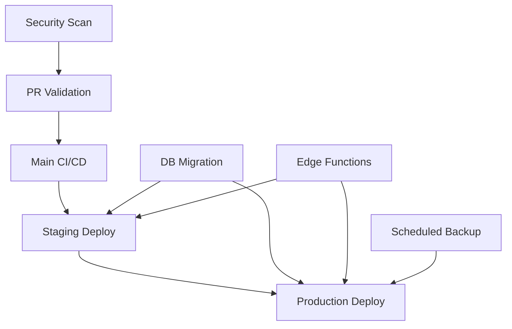

# GitHub Actions CI/CD Workflows

This directory contains comprehensive CI/CD workflows for the Pactwise Supabase backend.

## Workflows Overview

### 🔍 PR Validation (`pr-validation.yml`)
**Trigger**: Pull requests to main/develop branches
**Purpose**: Ensure code quality before merging

**Jobs**:
- **Lint**: ESLint and Prettier checks
- **TypeCheck**: TypeScript compilation
- **Unit Tests**: Sharded test execution
- **Integration Tests**: Full system tests with Supabase
- **Edge Functions**: Deno format/lint/type checks
- **SQL Lint**: Migration file validation
- **Security**: Trivy and secret scanning
- **Bundle Size**: Function size analysis

### 🚀 Main CI/CD (`main-cicd.yml`)
**Trigger**: Push to main branch or manual
**Purpose**: Full CI/CD pipeline with automated deployment

**Flow**:
1. Validate → Test → Build Image → Deploy Staging → Deploy Production (optional)
2. Automatic rollback on failure
3. Slack notifications
4. Version tagging and release creation

### 📦 Staging Deployment (`deploy-staging.yml`)
**Trigger**: Manual workflow dispatch
**Purpose**: Deploy specific branches to staging

**Features**:
- Branch selection
- Pre-deployment validation
- Database snapshots
- Warm-up procedures
- Smoke tests
- Deployment tracking

### 🏭 Production Deployment (`deploy-production.yml`)
**Trigger**: Manual workflow dispatch
**Purpose**: Controlled production deployments

**Safety Features**:
- Approval requirements
- Staging validation check
- Full database backup
- Maintenance mode
- Health checks
- Automatic rollback
- Post-deployment verification

### 🗄️ Database Migration (`database-migration.yml`)
**Trigger**: Manual workflow dispatch
**Purpose**: Safe database schema changes

**Capabilities**:
- Apply/rollback/validate/diff migrations
- Environment selection
- Backup before changes
- Migration analysis
- Post-migration validation

### ⚡ Edge Functions Deploy (`edge-functions-deploy.yml`)
**Trigger**: Manual workflow dispatch
**Purpose**: Deploy specific or all edge functions

**Features**:
- Function selection
- Lint and type checking
- Bundle size analysis
- Health checks
- Rollback capability

### 💾 Scheduled Backup (`scheduled-backup.yml`)
**Trigger**: Daily at 2 AM UTC, Weekly full backup Sunday 3 AM UTC
**Purpose**: Automated database backups

**Features**:
- Incremental/full backups
- S3 storage with lifecycle
- Backup verification
- Old backup cleanup
- Restore testing

### 🔒 Security Scanning (`security-scan.yml`)
**Trigger**: Daily at 4 AM UTC, PRs, and manual
**Purpose**: Continuous security monitoring

**Scans**:
- Dependency vulnerabilities
- Code security (Semgrep, CodeQL)
- Secret detection
- Infrastructure security
- SQL injection patterns
- API security testing
- Compliance checks

## Workflow Dependencies



## Required Secrets

### Core Secrets
- `SUPABASE_ACCESS_TOKEN`: CLI authentication
- `SUPABASE_URL`: Project URL
- `SUPABASE_ANON_KEY`: Anonymous key
- `SUPABASE_SERVICE_ROLE_KEY`: Service role key

### Environment-Specific
- `{ENV}_PROJECT_ID`: Project reference
- `{ENV}_DB_PASSWORD`: Database password
- `{ENV}_SUPABASE_URL`: Environment URL
- `{ENV}_SUPABASE_ANON_KEY`: Environment anon key

### External Services
- `OPENAI_API_KEY`: AI features
- `STRIPE_SECRET_KEY`: Payment processing
- `REDIS_URL`: Caching/rate limiting
- `RESEND_API_KEY`: Email service
- `SENTRY_DSN`: Error tracking

### AWS (for backups)
- `AWS_ACCESS_KEY_ID`: AWS credentials
- `AWS_SECRET_ACCESS_KEY`: AWS credentials
- `AWS_REGION`: AWS region
- `AWS_BACKUP_ROLE_ARN`: OIDC role
- `BACKUP_BUCKET`: S3 bucket name

### Notifications
- `SLACK_WEBHOOK`: Deployment notifications
- `CODECOV_TOKEN`: Coverage reporting

### Security
- `SEMGREP_APP_TOKEN`: Code analysis
- `PRODUCTION_DEPLOYERS`: Authorized users (comma-separated)

## Usage Examples

### Deploy to Staging
```yaml
# Via GitHub UI:
Actions → Deploy to Staging → Run workflow
  Branch: main
  Run migrations: ✓
  Deploy functions: ✓
  Run tests: ✓
```

### Production Release
```yaml
# 1. Create release tag
git tag v1.2.3
git push origin v1.2.3

# 2. Via GitHub UI:
Actions → Deploy to Production → Run workflow
  Version tag: v1.2.3
  Run migrations: ✓
  Deploy functions: ✓
  Maintenance mode: ✓
  Dry run: ✗
```

### Emergency Rollback
```yaml
Actions → Database Migration → Run workflow
  Environment: production
  Type: rollback
  Migration name: 023_feature_name
  Dry run: ✗
```

## Best Practices

1. **Always test in staging first**
2. **Use dry-run for production changes**
3. **Monitor deployments for at least 1 hour**
4. **Keep secrets rotated quarterly**
5. **Review security scan results weekly**

## Monitoring

### Deployment Status
- GitHub Actions tab shows all workflow runs
- Slack notifications for critical events
- Deployment status in GitHub Deployments

### Metrics to Watch
- Workflow success rate
- Deployment frequency
- Rollback frequency
- Security findings trend
- Backup success rate

## Troubleshooting

### Common Issues

1. **Workflow fails with permission error**
   - Check repository secrets
   - Verify OIDC role configuration
   - Ensure user has deployment permissions

2. **Deployment timeout**
   - Check Supabase service status
   - Verify network connectivity
   - Review function bundle sizes

3. **Migration failure**
   - Check SQL syntax
   - Verify migration order
   - Test in local environment first

### Debug Mode

Enable debug logging:
```yaml
env:
  ACTIONS_STEP_DEBUG: true
  ACTIONS_RUNNER_DEBUG: true
```

## Maintenance

### Regular Tasks
- Review and update workflow versions monthly
- Clean up old workflow runs quarterly
- Update secret values as needed
- Review deployment permissions

### Workflow Updates
1. Test changes in a feature branch
2. Create PR with workflow changes
3. Test in staging environment
4. Merge to main after validation